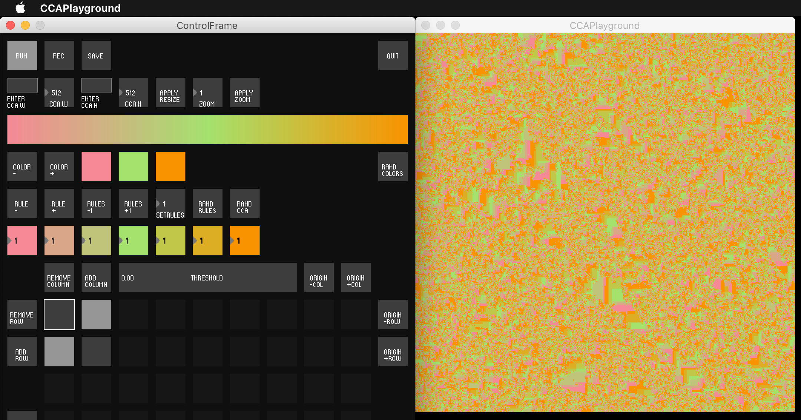
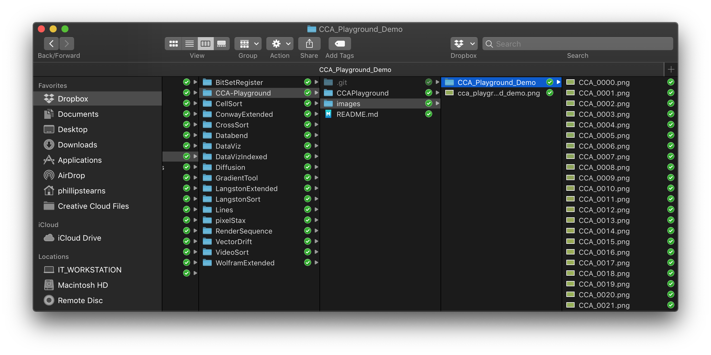

# CCA Playground

A tool for exploring Cyclical Cellular Automata
Written by Phillip David Stearns using [Processing3](https://processing.org)

## Cyclical Cellular Automata

>A cyclic cellular automaton is a kind of cellular automaton rule developed by David Griffeath and studied by several other cellular automaton researchers. In this system, each cell remains unchanged until some neighboring cell has a modular value exactly one unit larger than that of the cell itself, at which point it copies its neighbor's value. - [[source](https://en.wikipedia.org/wiki/Cyclic_cellular_automaton)]

The system comprises a 2D grid of 'M' states, a neighborhood of nearby cells, and thresholds for each state '0' - 'M-1'. The grid of states starts out randomized. Each iteration, all cells are evaluated individually. For each cell, whose state is 'n', its neighbors are counted if their state is 'n+1 % M'. `%` or modulus basically wraps the value around the max number of states, 'M', back to 0. If the neighbor count is greater than a threshold for its current state, then it takes on the state 'n+1 % M'.

CCA Playground has some nifty features we'll explore in detail:

* Adjustable size and scaling
* Gradient tool for creating custom palettes
* Rule editor for specifying number of states and the threshold for each
* A flexible neighborhood editor

While this program should be immune to button mashing and get you some pretty interesting results, I highly recommend reading on to get a better sense of what is going on.
 
## Installing

1. Download and install Processing3
2. Launch Processing3
3. Install the controlP5 library from Contribution manager located in Sketch > Import Library... > Add Library...
4. Clone this repository
5. Open `CCAPlayground.pde`

## Operation

### Run CCAPlayground.pde

* Click the `RUN` button with the "play" symbol on it.

### Controls

* This is where you work your magic.

### Display

* Magic manifests here... but wait. It's blank!

### Randomize the States and Run

* Click `RAND STATES` to randomize the states. Due to some issues with the load order, this doesn't seem to automagically happen yet. Need to dig into the code to find out what's up.

* Click `RUN`, and your display should perk up. `RUN` starts and stops both evaluation and rendering of the CCA.
* **NOTE:** You'll need to stop running, then randomize to ensure all the states update. This is due to some timing issues I need to workout.

## Changing the size of your CCA: Resizing

* RESIZING: You can both change the width and height of states in your CCA Playground. By default, these are set to 512 x 512.
* SCALING: You can also change the scaling of these states. The default is 1. This number is an integer used to scale up the states when rendered.

There are two ways you can change the size of your CCA:

* Manually type a value into the text field `ENTER CCA W` or `ENTER CCA H` and press enter to transfer it to the neighboring number box.

* You can also set a new value by clicking the `CCA W` or `CCA H` number box and dragging up or down.

* Apply the new size values by clicking the `APPLY RESIZE` button.
* **NOTE**: This should generate a new CCA with your specified dimensions and randomize its states.

## Changing the scale of your rendering: Scaling

* SCALING: You can change the scaling of the rendered CCA states. The default is 1. This number is an integer used to scale up the states when rendered. A `ZOOM` of `3` renders each state as a 3x3 pixel. The display window is scaled up to accommodate.
* **NOTE:** The display size is calculated by multiplying the CCA states width and height by the zoom amount. It's recommended to first resize your CCA states before dramatically scaling them up with a high zoom value.

* Set a new scale factor by clicking `ZOOM` and dragging up or down.

* Apply the new scale values by clicking the `APPLY ZOOM` button.

* If you followed along and used the values `480` for `CCA W`, `270` for `CCA H`, and a `ZOOM` of 4, then you have a 1920x1080 display where each state is represented by a 4x4 pixel square. Big pixels = big win!

## Gradient Tool

Rather than randomly assigning each state a color, colors are pulled from a gradient. The gradient is maintained as states are added or removed. The color of each state, is determined by its position, 'p', along the gradient, 'p'/(n-1)', where 'n' is the total number of states.

By default, the gradient starts with three colors. These can be added or removed, randomized, and customized.

* Clicking a palette toggle spawns a color wheel.
* The hue and brightness are set with a circle on the wheel itself.
* The saturation is set with a small triangle slider on the left of the picker window.

* `COLOR +` adds a random color to the gradient palette.

* `COLOR -` removes the last color from the gradient palette.

* `RAND COLORS` randomizes all colors in the gradient palette.

## Rule Editor

A cell state advances based on the thresholds set by these rules. The number of rules determines the total number of states in the CCA system. Currently there is a maximum of 11 states. The rules are assigned a color from the gradient and their value sets the threshold. This threshold is used to determine if there are enough neighbors (as defined by the neighborhood) to advance to the next state.

Rule thresholds can be edited by clicking and dragging each rule number box up or down.

* `RULE +` adds a rule

* `RULE -` removes a rule

* `RULES -1` subtracts one from all the current rule values

* `RULES +1` add one to all the current rule values

* `SETRULES` number box can be clicked and dragged up or down to set all rule values

* `RAND RULES` randomizes the ruleset, but currently isn't very useful since high threshold values can cause the CCA simulation to stall.

## Neighborhood Editor

The neighborhood is defined by a matrix of toggles and an origin representing the current cell to be evaluated. Activated cells in the matrix are evaluated. The origin is never evaluated against itself, only active neighbors within the neighborhood.

By default, the neighborhood is 2x2 with active neighbors randomly assigned within. The origin always starts at row 0, col 0. You can add rows and columns to the matrix, select which neighboring cells to include in evaluation, move the origin, and randomize all these things.

* Add and remove columns using the `ADD COLUMN` and `REMOVE COLUMN` buttons.
* Note: You cannot remove a column which contains the origin. You have to move the origin first.

* Add and remove rows using the `ADD ROW` and `REMOVE ROW` buttons.
* Note: You cannot remove a row which contains the origin. You have to move the origin first.

* The active rows and columns show up lighter than the inactive ones. Active toggles can be set to on or off. These indicate which neighbors to include when the cell is evaluated. 

* `ORIGIN -COL`, `ORIGIN +COL`, `ORIGIN -ROW`,`ORIGIN +ROW` are used to move the origin within the active matrix

### How are we doing?

 If you've been following along, you should have something like this:

### Randomization

Of course, all the neighborhood parameters can be randomized!

* `RAND HOOD` randomizes the entire neighborhood
* `RAND MATRIX ORIGIN` randomizes which neighbors are selected and the location of the origin
* `RAND MATRIX` randomizes only which neighbors are selected
* `RAND ORIGIN` randomizes only the location of the origin

## Saving

Saving a still is pretty simple. Saving an image sequence is too, but this part could use some work.

* `SAVE` will open an OS dialog. If this doesn't stop the animation, and you want to capture exactly what you're seeing in the display, be sure to click `RUN` to stop rendering new frames.

* OPINION: I highly recommend using `.png` to save your images. They're lossless and don't take up much space. `.jpg` are only good for distribution where size is an issue. `.gif` Is OK. `.tif` is too big.

* Make sure to click `RUN` to stop rendering.
* Click `RAND STATES` if you want to start your recording fresh.
* Click `REC` to open the folder selection dialogue.

* Navigate to where you want to save your image sequence to and create a new folder.

* Select that folder.
* **NOTE:** By default, the sequence is saved in that folder with the name `CCA_<zero padded sequence number>.png`. Will be improving this later.
* Click `RUN` to start rendering and saving. Writing each frame significantly slows things down.
* Click `REC` to stop the recording.

* Click `QUIT` when you're finished

* Go have a look at your exports!
